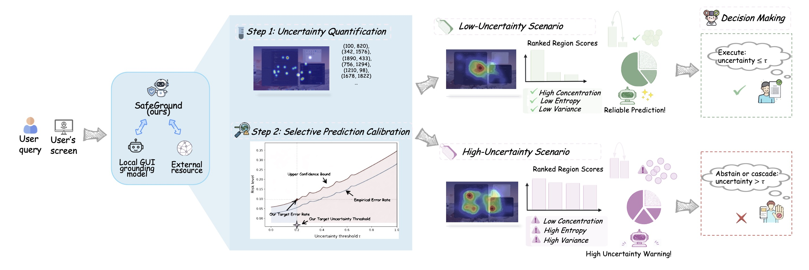

# SafeGround: Know When to Trust GUI Grounding Models via Uncertainty Calibration

This repository contains the **official implementation of SafeGround**, an uncertainty-aware framework for reliable and risk-controlled GUI grounding under limited model access.

SafeGround estimates *spatial uncertainty* by aggregating multiple stochastic grounding predictions into a patch-level probability distribution, and calibrates uncertainty thresholds with finite-sample guarantees. This enables risk-aware deployment of GUI agents through selective prediction and safe deferral.

<p align="center">
  
</p>

**Paper:**
📄 *SafeGround: Know When to Trust GUI Grounding Models via Uncertainty Calibration*
🔗 [https://arxiv.org/abs/2602.02419](https://arxiv.org/abs/2602.02419)

**Project Page:**
🔗 [https://safeground-ericlab.github.io](https://safeground-ericlab.github.io)


---

## Repository Structure

```
SAFEGROUND/
├── heatmap.py          # Heatmap construction from sampled coordinates
├── regions.py          # Connected region extraction (4-connectivity BFS)
├── margin.py           # Margin-based uncertainty (top-2 ambiguity)
├── entropy.py          # Entropy-based uncertainty (distributional dispersion)
├── concentration.py    # Concentration-based uncertainty (HHI complement)
├── combined.py         # Weighted combination of uncertainty measures
├── uncertainty.py      # Unified uncertainty computation API
├── fdr_control.py      # Finite-sample FDR control (Clopper–Pearson)
└── README.md           # Project documentation
```

---

## Uncertainty Quantification Pipeline

**Pipeline:**
**Stochastic Coordinates → Patch Heatmap → Spatial Regions → Uncertainty Score**

Given multiple stochastic grounding samples, SafeGround constructs a spatial probability distribution over a patch grid, identifies coherent high-probability regions, and computes region-level uncertainty measures that capture different failure modes of GUI grounding.


---

## Risk Control via FDR Calibration

SafeGround calibrates an uncertainty threshold on a held-out calibration set to control the **False Discovery Rate (FDR)** of accepted predictions.

### Clopper–Pearson Upper Confidence Bound

Given (w) observed errors among (m) accepted samples, the FDR upper bound is computed as:

```
r_upper = Beta.ppf(1 - α, w + 1, m - w)
```

The largest threshold whose upper bound does not exceed the target risk level is selected for deployment.

### Reported Metrics

| Metric            | Description                                |
| ----------------- | ------------------------------------------ |
| `threshold`       | Calibrated uncertainty threshold           |
| `power`           | Fraction of correct predictions retained   |
| `abstention_rate` | Fraction of predictions rejected           |
| `upper_bound`     | Clopper–Pearson FDR upper confidence bound |

---
More code coming soon.

## Citation

If you find this work useful, please cite:

```bibtex
@misc{wang2026safegroundknowtrustgui,
  title={SafeGround: Know When to Trust GUI Grounding Models via Uncertainty Calibration},
  author={Qingni Wang and Yue Fan and Xin Eric Wang},
  year={2026},
  eprint={2602.02419},
  archivePrefix={arXiv},
  primaryClass={cs.AI},
  url={https://arxiv.org/abs/2602.02419}
}
```
